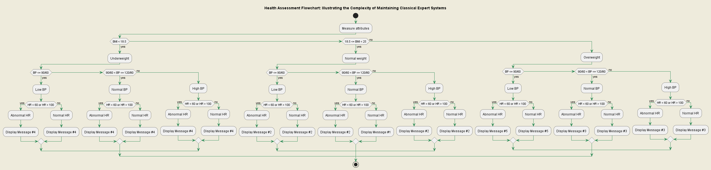
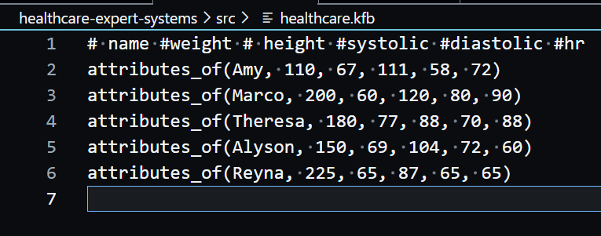
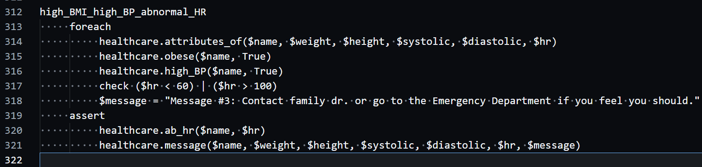
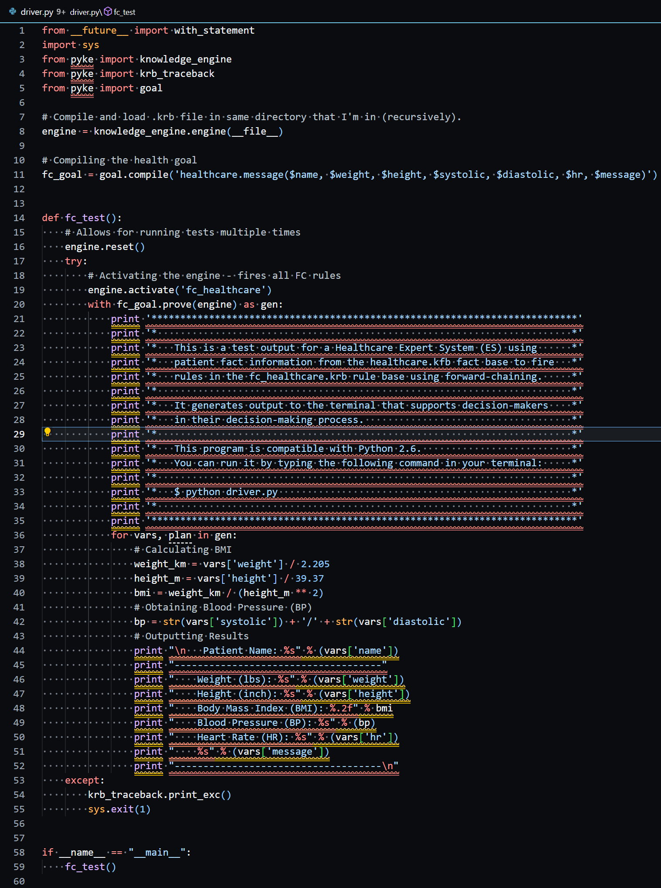
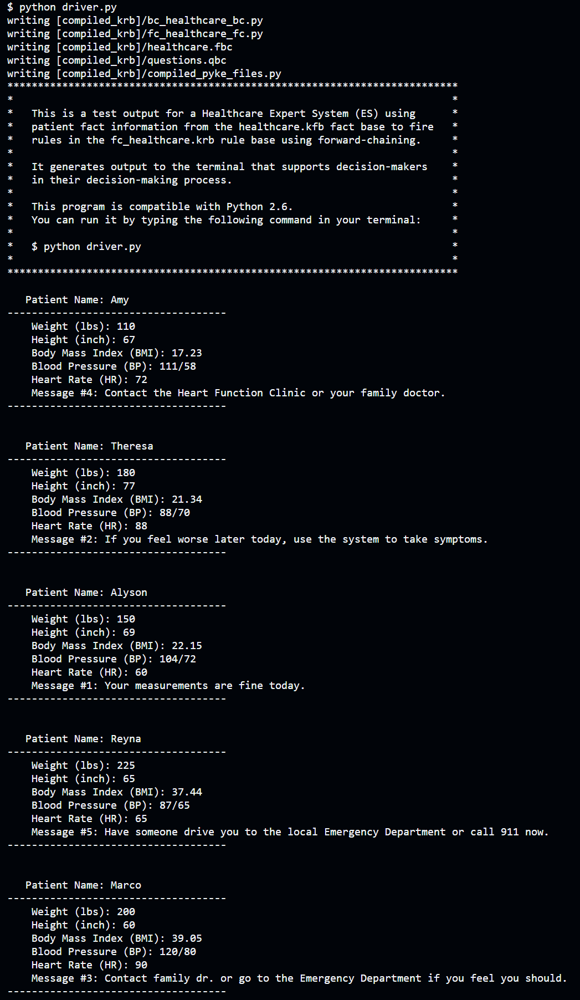

# Healthcare Expert Systems: A Heart Failure Telemonitoring Case Study

This repository demonstrates the transformative potential of rule-based expert systems in healthcare, particularly in enhancing patient self-care and improving the clinical management of heart failure. We've used Pyke, a Python-based knowledge-based system, to develop a robust and versatile tool that combines the logical expressiveness of Prolog with the wide-ranging functionality of Python.

## Health Assessment Flowchart

The flowchart below illustrates the complexity of maintaining classical expert systems. It demonstrates potential outcome states resulting from varying combinations of vital sign measurements. 

## Fact and Rule Bases

Pyke rules consist of 'if' and 'then' segments, traditionally referred to as premises and conclusions. Pyke programs contain rule bases, repositories of rules stored in .krb files, while known facts are stored in .kfb files known as fact bases.

Here's a look at our fact and rule bases:

- Fact Base: Contains known facts to inform the rule base. 
  

- Rule Base: Houses the rules for decision making based on the facts from the fact base.
  

Our rule base includes several rulesets designed to monitor patient health. For example, the rule named `high_BMI_high_BP_abnormal_HR` checks for patients who are obese, have high blood pressure, and an abnormal heart rate. If a patient meets these conditions, the system generates a message advising them to contact their doctor or visit the emergency department.

## Driver Code

Our driver code serves as the entry point for the application. This file contains the essential programming logic that initiates the expert system and facilitates the interaction between the rules and facts. 

## Program Execution

Running the program is simple: navigate to the directory of the driver.py file and run the command `python driver.py`. The program then outputs a domain-relevant recommendation based on the patient's vital signs, thereby enhancing the transparency of the expert system.

## Future Development

We envision integrating a question rule base and back-chaining rules into the expert system to significantly enhance its functionality. This would allow the system to ask targeted questions, enabling a more comprehensive and personalized analysis of each patient's health.

## Conclusion

This project demonstrates the value of rule-based expert systems in healthcare. With continued research and development, expert systems like the one presented here can significantly improve patient care and outcomes.

## License

This project is licensed under the terms of the [MIT License](./LICENSE).

## Acknowledgements

- We extend our sincere gratitude to [Seto et al., 2012](https://d1wqtxts1xzle7.cloudfront.net/53636536/Developing_healthcare_rule-based_expert_20170623-1911-623g2e-libre.pdf?1498223237=&response-content-disposition=inline%3B+filename%3DDeveloping_healthcare_rule_based_expert.pdf&Expires=1687232140&Signature=fUaxOkXdtLLMjAMvlChGYyUcCffuUxIpy95pbyUXabIsxKrcTqilvVvNmlUeqqKRgIGqAsq2jBk638vbwu7oy-cWgXdVLbdME3xqBXFDpYn~Xmt1akNm8Z35S099eEXc35CSRQvt~ZcaPcZr7~5DaaxLvsBk56Mz1uDvC~1F1iLOkC0xDIniHOMZnnG8VP4Hf~p3GG7UE8NbEcerM5sMEObFKdWsKL3ogsl6KZv2H-M6HARAX1ke3qWrzVpDwaRLipqU~uroYESjsj~x~1K9V1F8c3gkc3l6XW0DO3EnT~O9S9g4gXxkoVlG67Kw3ueC~rzlLWjSqPdMEaIew06BhQ__&Key-Pair-Id=APKAJLOHF5GGSLRBV4ZA) whose work on rule-based expert systems for heart failure telemonitoring inspired this project.
- Thanks to the creators and maintainers of [Pyke](https://pyke.sourceforge.net/), the Python-based knowledge engine we've used in this project.

